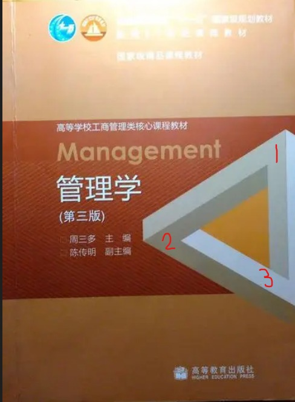

---
title: "从不可能三角形到高维世界：探寻维度对人类思维的影响"
categories: 
  - 哲学
  - 物理
tags:
  - 维度
  - 高维生物 
  - 低维生物 
header:
  overlay_image: /assets/images/三角形.jpg
tagline: 从三角形中窥视高维空间的秘密   
---
### 1. 二维世界中的矛盾体和三维世界中的投影

---

今天上管理学课，感觉没啥意思。我就开始研究封面上的这个三角形。大家仔细看，发现什么其妙处了吗？对！这个三角形看上去是合理的，但在三维空间中无论如何也造不出来！那么让我们仔细想一想这是为什么。

首先，我们为什么会认为这是一个三角立体。答案是因为他看上去很立体，那么是什么造就了这种立体的感觉呢？显而易见，是阴影和光照。正因为有了明暗对比我们才会觉得它是立体的，实在的。但是，这种立体只存在于二维空间之中，由此，这就引发了一个问题。在二维平面模拟三维空间会出现某些错觉或者三维空间无法做出来的形状。

于是我联想到，低一级的维试图模仿高一级的维会出现某些BUG，也就是说试图在三维中模拟四维有时会出现在四维中无法存在的形状，也就是说低级维可以在概念上超越高维的某些情况。比如你在平面上画一些看似合理的三维体但总是矛盾的，在三维中无法存在的矛盾体，但这种“异端”，存在于低一级的维并且可以很合理稳定的存在。但是在低级维生物本身不会理解这个矛盾体，因为矛盾体是存在于低级维但只有高级维可以理解，因为其中存在高级维的信息，但对于低级维的生物来说这是无意义的。

### 2. 低维度试图模仿高维度的BUG

---

下面我们在来研究一下这个物体，其实类似的矛盾体有很多，这只是其中一个例子。我们把这个矛盾体分解。其实这个“体”只是三个色块的组合，即1,2,3这三种色块，二维生物在他们看来只是一个区域而已，即使是把整个色块拼合好，他们也永远无法理解这是什么东西。但是，如果二维生物在不经意之中绘制了这个图形，那么这个图形三维生物就可以理解，可是，这又引出一个问题，二维世界有颜色这个概念吗？

颜色是光打到原子内部激发产生的，但是在二维世界里，有原子吗？如果有那是一种什么形式，可以发出或反射光吗？还有二维世界有太阳吗？二维世界注定是我们三维世界永远无法探寻的一个禁区，因为这个世界从根本上与我们完全不同，三维生物的思维也已僵化在三维之中。其实我认为思维是可以超越维度的，在各维中应该是有互通共性的。好了，回到原话题之中，如果进行类比，从四维空间中看我们的三维世界，我们所做的一切或许在无意之间制作了一件四维作品，这个作品可以合理的存在于四维中，也可以是观念上是合理的，但永远无法存在于四维空间的实体，这或许可以说是低一级的维从某种意义上来说对高一级的维的一种特权，但这必须包括于高级维的特有性质，但是低级维永远无法理解高级维的世界这样的有什么意义！

### 3. 高维度对低维度的特权和隐藏的信息量

---

高级维对低级维来说，特权是巨大的，他们看我们就有如在透明玻璃缸里游泳的鱼，在我们三维世界看似完全无法实现的事情或许是顶尖的科学家都难以置信的事情，在高维世界里他们的3岁小孩都能完成（这里说的一切都是假设高维世界有着和低维世界差不多的社会体系）。正如我们的物体要想让二维世界的生物看见，在他们看起来就是我们这个物体在他们世界的投影，他们只是看到的投影！这是一种什么概念？这么解释，在纸上我们画一个圆，那么在二维生物看来就是一个圆，不会是其他什么，但是实际上在三维世界这个圆可以是许许多多的物体，圆的这一部分不过是物体其中的一部分在二维世界的投影，再从另一个角度解释，就像把一个物体切成无数平面，每个平面就是二维世界看到的像。这样就也就是说，高维对于低维来说，隐藏了数量巨大的信息，高一个维度就可以比原来扩充巨大的信息量，甚至是无限的。这么来说，四维世界对三维世界隐藏了巨量的信息，也可以这么说，每降低一个维度，就比原来维度损失巨量的信息。

可能我们世界里的一个立体形状就是四维世界无数物体的投影，这对于我们来说我们像是一位盲人，从类似切片的三维信息中去还原四维世界的物体，这种还原的成功的概率实际上是0。四维世界对于我们三维世界来说也是同样隐藏了巨量的信息。不单是四维，可以更高维，维度越高隐藏的信息量越大或许是无限的，但是高维世界必定是极小的，蜷缩状态的。

### 4. 地球围绕太阳转和空间弯曲

---

地球为什么围着太阳转，或许有人会说万有引力，但是实际上这是由于太阳的巨大质量引起周围空间弯曲。那么空间弯曲又是怎么一回事，我们可以这样类比，如果在地球上你永远朝着一个方向走，那么你必然回到原点，这很好理解，因为地球是圆的。这是因为地球的二维表面被弯曲成一个球面，这就是二维世界的空间弯曲，或许是地球的质量的使二维平面弯曲成首尾相连的形态。要弯曲空间必须要耗费巨大能量。那们我们就可以类比，最初地球因为太阳的引力从远处飞来，在进入太阳造成的弯曲空间之中，我们地球如果是有意识的，那么他还以为自己在直线飞向太阳，因为太阳把空间弯曲了，弯成了一个首尾相接的形态，地球就在这里无限旋转，被太阳造成的空间弯曲囚禁起来，现在在地球看起来，他还在完成自己的使命，向太阳飞奔。

### 5.二维世界的生物存在性和拓展科学研究的必要性

---

还有对于有些科学家认为二维不适合生物存在，他们认为二维世界的固有特质将一个生物分成两部分后无法愈合，对此我表示怀疑，二维世界如果有生物存在，必然是我们完全无法理解的形态，正如高维生物无法理解我们的存在一样，我们必须摒弃我们是宇宙中独一无二的这种思想，在没有证据证明我们是宇宙中唯一的存在时，我们不能有这种自大的想法，还有如果搞科学研究都是以地球的情况去出发，去寻找，那么有可能注定一事无成，拿着自己地球的理论去套用整个宇宙，我感觉不现实。正如我们把生命存在的条件确定为水，努力搜寻有水存在的星球，认为没有水就没有生命，这只是以地球本身的进化来当成宇宙中一切的真理。可以这么说，生命都是在具体特定环境下进化出来的，生命会根据自己所处的环境来改变自己的构成，如果我们还自以为是，那我们永远无法探索到除了碳基生命以外的硅基生命等其他生命形式。
